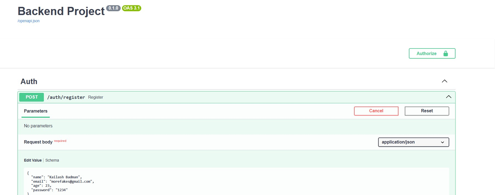
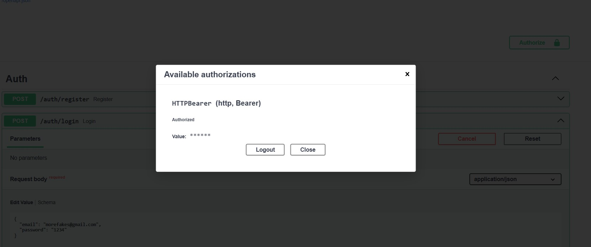
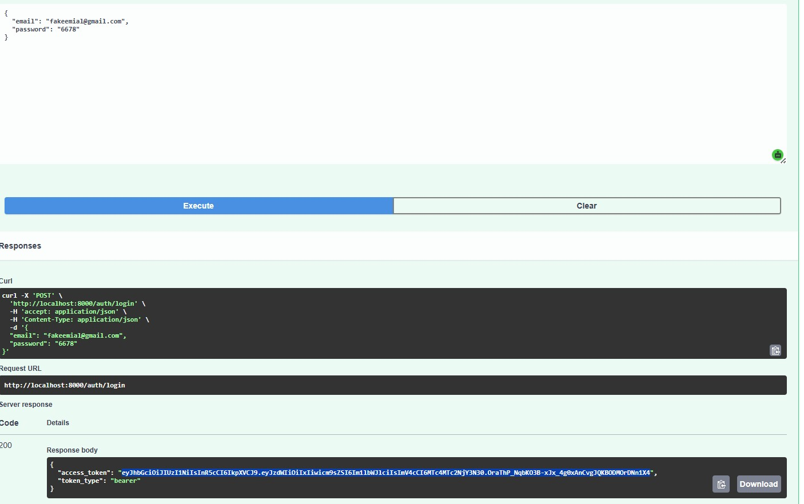
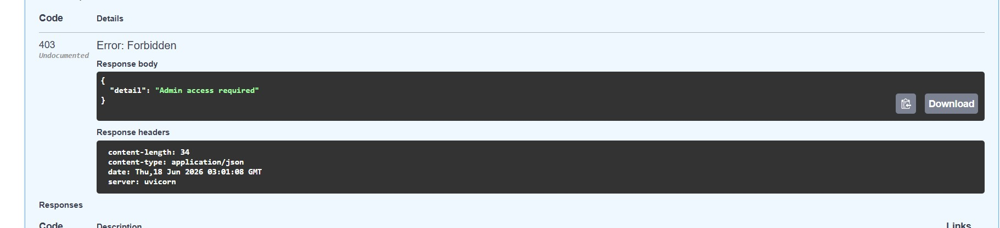
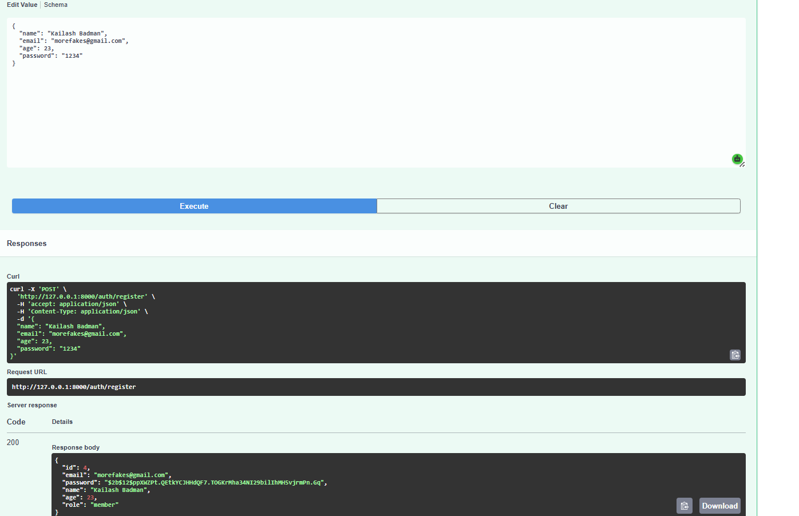
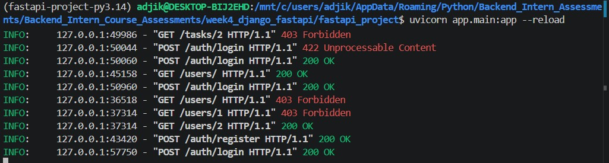

## FastAPI Project
- This is the real backend project for this week. I have upgraded or rather made few changes to meet this week's agenda on week3's project which was running on postgres via docker command. This week my database is connected with RDS with real authorization where admin exists to oversee the project,tasks and other users, including ownership of the project and JWT token and password hashing. 

### Key Features
- Uses swagger API to run the app.
- Contains JWT token structure to login
- Registered user will have their password hashed for security. 
- Your data is stored permanently on RDS, instead of storing on sqllite on a local computer. 

### Authorization
- You have an authorize button on top right, which lets your login using your access (JWT) token. 
 

 

#### Getting token after loggin in

#### Getting your access denied lest you are an admin
- Since its pretty risky if any user can perform crud operations on other users, access has only given to the admin.

#### Registering a user
- Creating a user or registering a user with your credentials will eventually have your password hashed, which is what's going on the database for security.

#### Endpoints 
- There are alot of endpoints to test out however since authrozation and ownership are two different things this week when we are talking about enpoints: Here is what the endpoints could look like if you are not authorized. 

