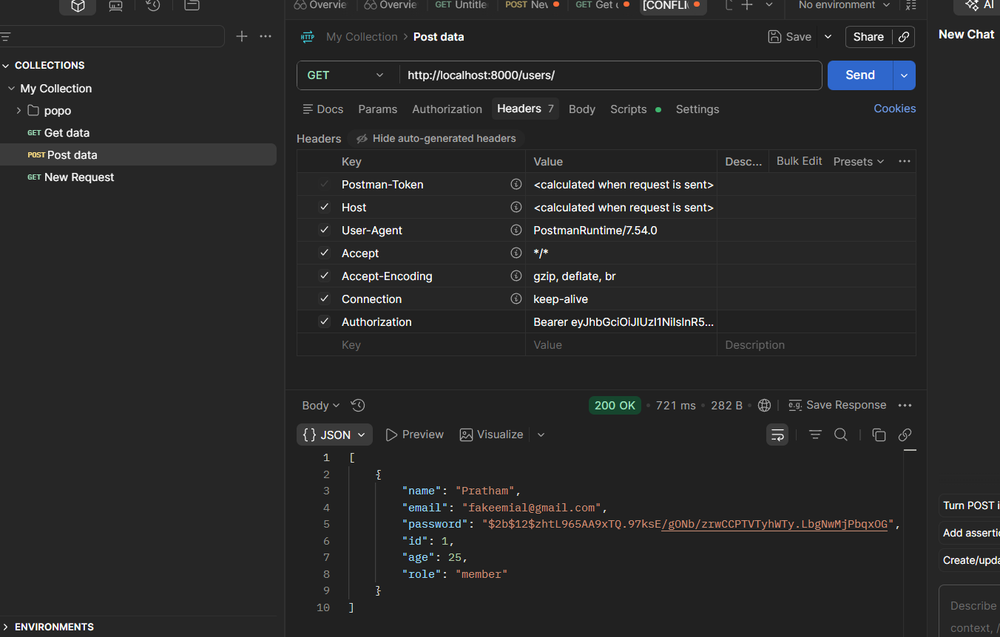
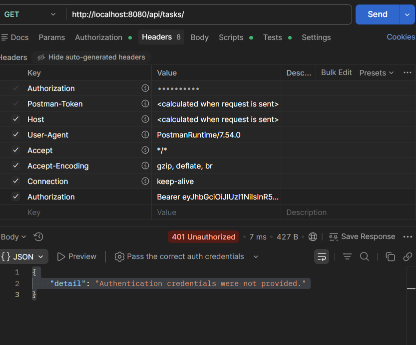
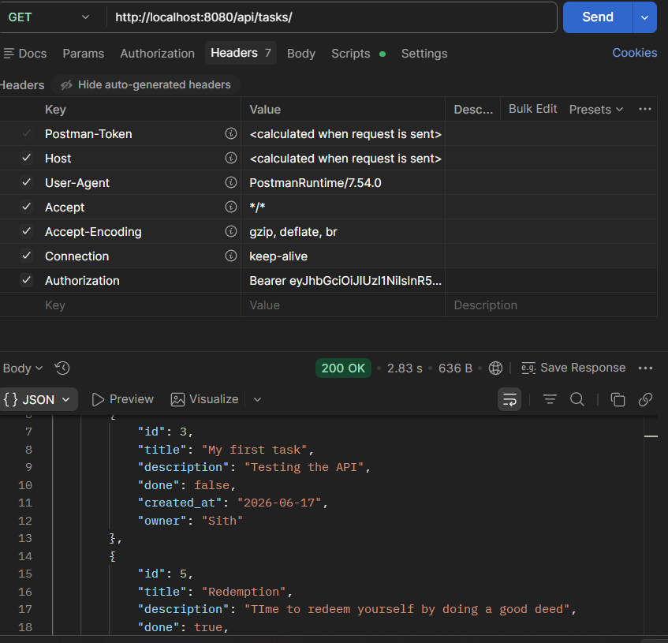

# Django Reference
- Tested Django Rest Framework, used JWT Token and password authentication to create user and give tasks, can also perform basic CRUD with django admin and 3rd party application like postman.   

## Django's impression 
- Django although being a tool for both front-end and back-end, it handles a lot of things like creating a server and hashing a password automatically. 

- Few screenshots to test my work for token and password authentication which I did via postman. 

- Loggin in using access token 

- Not Authorized 

- Users can have multiple tasks

## Templates 
- HTML docs are pretty unwanted, templates were not the focus this week since the project is API-first. You can create through Django admin itself. 

## Thoughts
Since Django was just a reference while fastapi is still going to the main backend. I might have added few extra things on django that was supposed to be on the main backend (FastAPI). I will also go ahead and add few things on main backend as well. Overally, Django had alot going on and can wee why full-stack work requires it, fastapi as a backend seems faster and performs quickly. 

